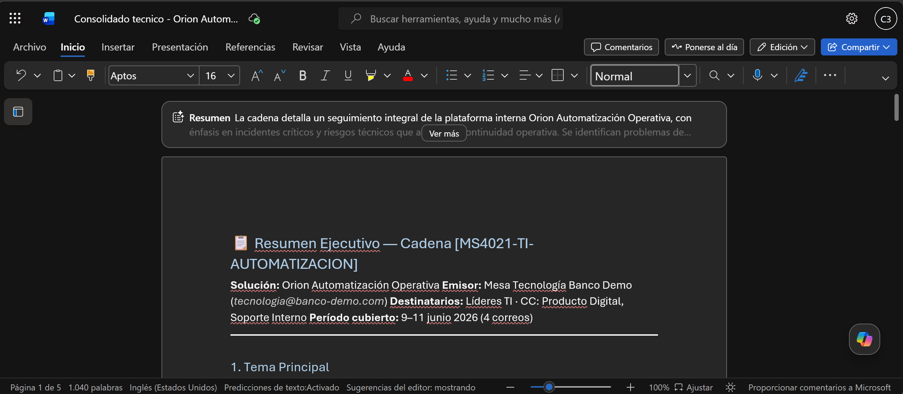

# Demostracion 1. Preparar el contexto técnico y operativo desde Outlook

## Objetivo de la practica:
Al finalizar la practica, seras capaz de:
- Priorizar correos relacionados con incidentes criticos, solicitudes de soporte y seguimiento de desarrollo.
- Usar Copilot en Outlook para resumir cadenas con foco tecnico, impacto operativo, riesgos y acciones pendientes.
- Construir un bloque de contexto que alimente el analisis posterior en Excel y Microsoft 365 Copilot.

## Duracion aproximada:
- 15 minutos.

## Tabla de ayuda:
| Elemento | Valor de referencia | Observaciones |
| --- | --- | --- |
| Aplicacion principal | Outlook con Microsoft 365 Copilot | Usar cuenta corporativa con acceso a Copilot. |
| Distintivo de busqueda | `[MS4021-TI-AUTOMATIZACION]` | Todos los correos del kit incluyen este texto en el asunto. |

## Instrucciones

### Tarea 1. Preparar el buzon y localizar correos tecnicos.
**Paso 1.** Abrir Outlook con la cuenta corporativa asignada para la demostracion.

**Paso 2.** Buscar correos usando el distintivo `[MS4021-TI-AUTOMATIZACION]`. De forma complementaria, usar palabras clave como: `incidente`, `soporte`, `ticket`, `adopcion`, `Orion`, `automatizacion`, `backlog`, `sprint`, `continuidad`.

**Paso 3.** Identificar los cuatro correos consolidados del kit:
- Incidentes criticos y solicitudes urgentes de soporte.
- Seguimiento de tickets, desarrollo y continuidad operativa.
- Metricas de adopcion, uso y feedback de usuarios internos.
- Riesgos operativos, oportunidades de automatizacion y decisiones pendientes.

**Paso 4.** Marcar los correos con mayor urgencia tecnica, especialmente incidentes criticos y riesgos operativos.

---

### Tarea 2. Usar Copilot en Outlook para resumir y priorizar.
**Paso 1.** Abrir el primer correo relacionado con incidentes criticos.

**Paso 2.** Seleccionar Copilot en Outlook y solicitar un resumen ejecutivo del hilo.

Prompt sugerido:
```text
Resume esta cadena de correos desde una perspectiva de liderazgo de Tecnologia. Identifica:
1. Tema principal.
2. Incidentes, solicitudes o tickets mencionados.
3. Impacto operativo y areas afectadas.
4. Riesgos tecnicos o de continuidad.
5. Dependencias con desarrollo, soporte, seguridad o arquitectura.
6. Acciones pendientes.
7. Nivel de urgencia: alto, medio o bajo.
```

**Paso 3.** Repetir el analisis con los otros tres correos consolidados.

**Paso 4.** Solicitar a Copilot que integre los cuatro resumenes en un solo bloque ejecutivo.

Prompt sugerido:
```text
Consolida los resumenes de los cuatro correos en un bloque ejecutivo para lideres de Tecnologia. Organiza el resultado con:
1. Incidentes criticos.
2. Solicitudes de soporte urgentes.
3. Seguimiento de desarrollo y tareas pendientes.
4. Metricas o senales de adopcion.
5. Riesgos de continuidad.
6. Acciones recomendadas para continuar el analisis en Excel y Copilot Chat.
```

**Paso 5.** Exportar el consolidado a Word con el titulo `Consolidado tecnico - Orion Automatizacion Operativa`.


### Resultado esperado
Al finalizar, el instructor debe contar con un consolidado tecnico que priorice incidentes, tickets, adopcion, continuidad y acciones pendientes para evaluar la solucion interna Orion.

