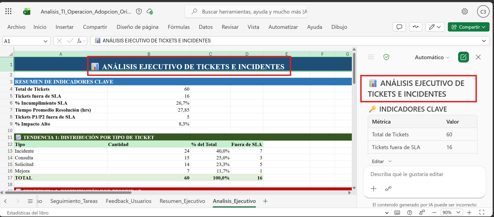
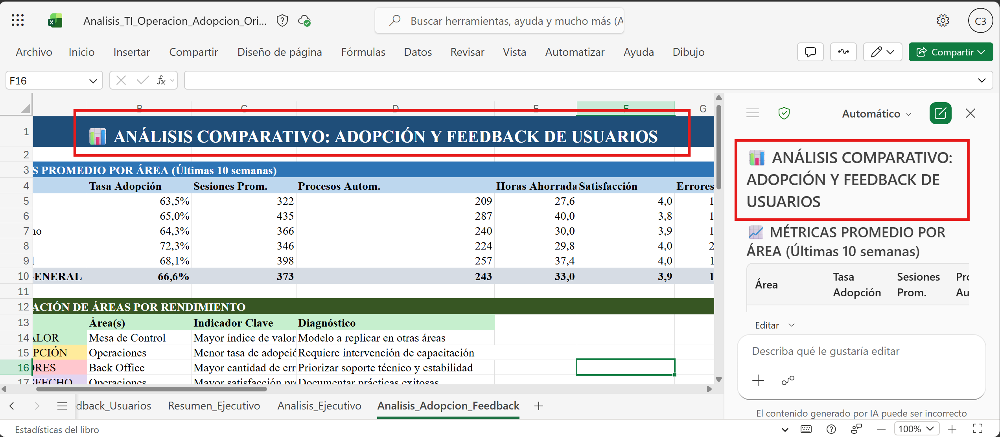
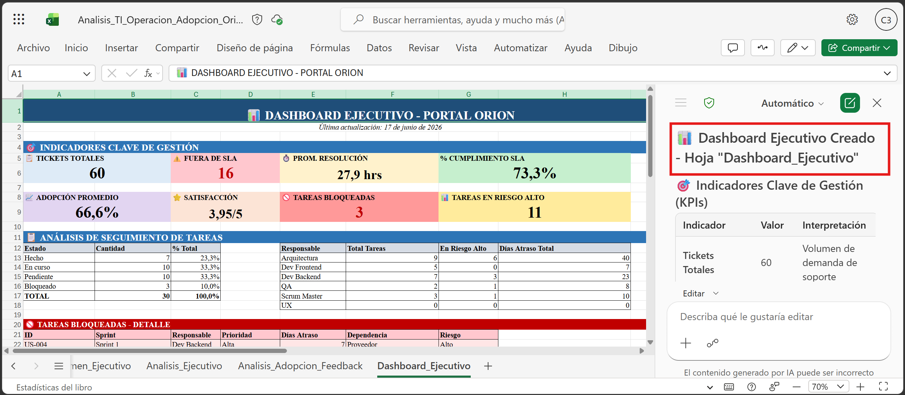

# Demostracion 2. Analizar informacion tecnica y operativa con Copilot en Excel

## Objetivo de la practica:
Al finalizar la practica, seras capaz de:
- Usar Copilot en Excel para analizar tickets, incidentes, adopcion y seguimiento de tareas.
- Identificar tendencias, riesgos operativos, brechas de SLA y oportunidades de automatizacion.
- Convertir datos tecnicos en explicaciones claras para lideres tecnicos y funcionales.

## Duracion aproximada:
- 20 minutos.

## Tabla de ayuda:
| Elemento | Valor de referencia | Observaciones |
| --- | --- | --- |
| Aplicacion principal | Excel con Copilot | Trabajar con el archivo guardado en OneDrive o SharePoint. |
| Archivo base | `Analisis_TI_Operacion_Adopcion_Orion.xlsx` | Contiene tickets, adopcion, tareas y feedback de usuarios. |


## Instrucciones

### Tarea 1. Abrir el archivo y revisar la estructura.
**Paso 1.** Abrir Excel en el navegador o aplicacion de escritorio.

**Paso 2.** Abrir `Analisis_TI_Operacion_Adopcion_Orion.xlsx` desde OneDrive o SharePoint.

**Paso 3.** Revisar las hojas del archivo y explicar que los datos son ficticios.

---

### Tarea 2. Analizar incidentes, SLA y tendencias.
**Paso 1.** Abrir la hoja `Tickets_Incidentes`.

**Paso 2.** Solicitar a Copilot identificar patrones de incidentes.

Prompt sugerido:
```text
Analiza la hoja Tickets_Incidentes e identifica las tres tendencias mas relevantes por tipo de ticket, prioridad, componente y area afectada. Presenta el resultado en una tabla ejecutiva.
```

**Paso 3.** Solicitar un analisis de tickets fuera de SLA.

Prompt sugerido:
```text
Identifica los tickets que no cumplen SLA y explica que componentes, areas y prioridades concentran mayor riesgo operativo. Incluye recomendaciones de accion.
```

**Paso 4.** Pedir a Copilot que resalte filas criticas.

Prompt sugerido:
```text
Resalta las filas donde Prioridad sea P1 o P2 y Cumple_SLA sea No. Luego resume que patrones se repiten.
```

---

### Tarea 3. Revisar adopcion, uso y experiencia de usuarios.

**Paso 1.** Abrir la hoja `Adopcion_Uso`.

**Paso 2.** Solicitar una lectura de adopcion por area.

Prompt sugerido:
```text
Compara la tasa de adopcion, sesiones, procesos automatizados y satisfaccion por area. Identifica areas con mayor valor, areas con baja adopcion y posibles causas.
```

**Paso 3.** Abrir la hoja `Feedback_Usuarios` y pedir un resumen de percepcion.

Prompt sugerido:
```text
Resume los principales temas del feedback de usuarios internos. Clasifica cada tema como riesgo operativo, necesidad de capacitacion, mejora de producto o comunicacion.
```



---

### Tarea 4. Analizar seguimiento de tareas y backlog.

**Paso 1.** Abrir la hoja `Seguimiento_Tareas`.

**Paso 2.** Solicitar a Copilot identificar bloqueos y dependencias.

Prompt sugerido:
```text
Analiza la hoja Seguimiento_Tareas e identifica tareas bloqueadas, responsables con mayor carga, dependencias criticas y tareas que deberian priorizarse en el siguiente sprint.
```

**Paso 3.** Solicitar un dashboard ejecutivo.

Prompt sugerido:
```text
Crea un dashboard ejecutivo en una hoja nueva con indicadores clave: tickets totales, tickets fuera de SLA, promedio de resolucion, adopcion promedio, satisfaccion promedio, tareas bloqueadas y principales riesgos operativos.
```

### Resultado esperado
Al finalizar, el instructor debe contar con hallazgos sobre incidentes, adopcion, tareas, feedback y oportunidades de mejora para usar en la siguiente demostracion.

