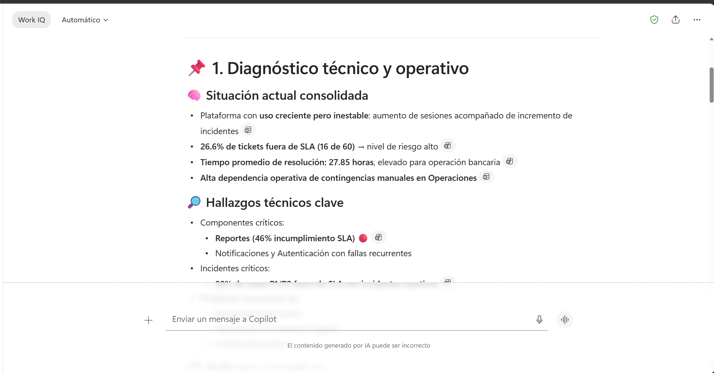
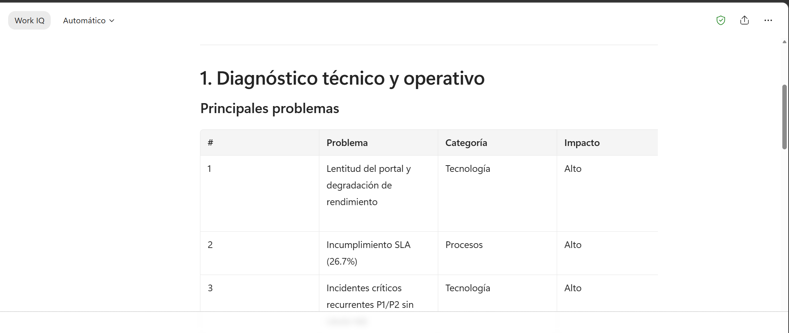
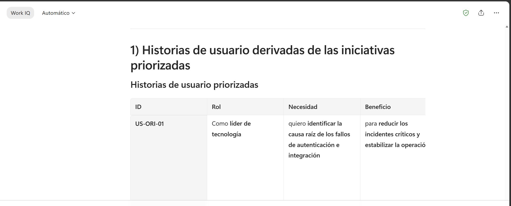
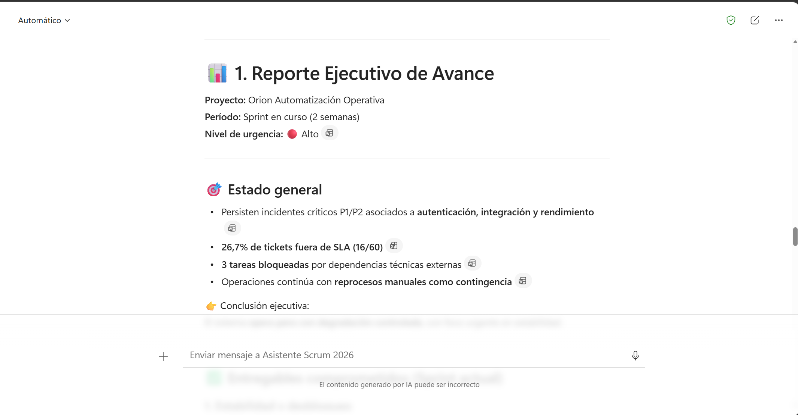

# Demostracion 3. Gestionar iniciativas tecnologicas con Microsoft 365 Copilot y Agente Scrum

## Objetivo de la practica:
Al finalizar la practica, seras capaz de:
- Usar Microsoft 365 Copilot para convertir hallazgos tecnicos en iniciativas priorizadas.
- Refinar prompts con Prompt Coach para obtener mejores historias de usuario, criterios y reportes.
- Simular seguimiento agil con Agente Scrum, backlog, planning, review y comunicacion ejecutiva.

## Duracion aproximada:
- 20 minutos.

## Tabla de ayuda:
| Elemento | Valor de referencia | Observaciones |
| --- | --- | --- |
| Aplicaciones principales | Microsoft 365 Copilot Chat, Prompt Coach, Agente Scrum de Copilot | Usar modo trabajo o chat segun disponibilidad. |
| Insumos | Consolidado de Outlook, hallazgos de Excel | Se usan como contexto del ejercicio. |

## Instrucciones

### Tarea 1. Consolidar contexto en Microsoft 365 Copilot.
**Paso 1.** Abrir Microsoft 365 Copilot desde `https://m365.cloud.microsoft.com/`.

**Paso 2.** Pegar o adjuntar el consolidado de Outlook y los hallazgos de Excel
    
Prompt sugerido:
```text
Actua como Product Owner y asesor de Tecnologia para un banco. Con base en el consolidado de Outlook y los hallazgos de Excel, genera una propuesta de seguimiento estrategico del producto.

Incluye:
1. Diagnostico tecnico y operativo.
2. Riesgos principales.
3. Oportunidades de automatizacion.
4. Iniciativas priorizadas para 60 dias.
5. Dependencias criticas.
6. Indicadores de exito.
7. Decisiones requeridas a liderazgo.
```



---

### Tarea 2. Refinar el prompt con Prompt Coach.
**Paso 1.** Solicitar a Prompt Coach mejorar el prompt anterior para hacerlo mas preciso.

Prompt sugerido:
```text
Mejora este prompt para obtener un plan mas accionable de mejora tecnologica. Debe incluir criterios de priorizacion, riesgos, dependencias, responsables, metricas de adopcion y entregables por sprint.
```

**Paso 2.** Ejecutar el prompt refinado y revisar la respuesta.


---

### Tarea 3. Generar historias de usuario y criterios de aceptacion.
**Paso 1.** Pedir a Copilot que convierta las iniciativas en historias de usuario.

Prompt sugerido:
```text
Convierte las iniciativas priorizadas en historias de usuario. Para cada historia incluye: rol, necesidad, beneficio, criterios de aceptacion, prioridad, dependencia y metrica de exito.
```

**Paso 2.** Solicitar una matriz de priorizacion del backlog.

Prompt sugerido:
```text
Crea un backlog priorizado con las columnas: ID, historia de usuario, impacto, urgencia, esfuerzo, dependencia, responsable sugerido, sprint recomendado y riesgo de no actuar.
```



---

### Tarea 4. Usar Agente Scrum para seguimiento operativo.
**Paso 1.** Abrir el Agente Scrum de Copilot, si esta disponible en el entorno.

**Paso 2.** Solicitar un resumen de planning para el siguiente sprint.

Prompt sugerido:
```text
Actua como Scrum Master. Con base en este backlog priorizado, prepara una propuesta de sprint planning para dos semanas. Incluye objetivo del sprint, historias seleccionadas, criterios de aceptacion, riesgos, dependencias y preguntas para el equipo.
```

**Paso 3.** Solicitar un reporte ejecutivo de avance.

Prompt sugerido:
```text
Genera un reporte ejecutivo de avance para liderazgo tecnico y funcional. Incluye: entregables comprometidos, bloqueos, riesgos, decisiones requeridas y proximos pasos.
```

**Paso 4.** Crear una agenda de reunion tecnica.

Prompt sugerido:
```text
Crea una agenda para una reunion de 30 minutos con lideres tecnicos y funcionales para revisar incidentes, adopcion, backlog y decisiones requeridas. Incluye objetivo, temas, responsables y resultado esperado.
```

### Resultado esperado
Al finalizar, el instructor debe contar con iniciativas priorizadas, historias de usuario, backlog, reporte de avance y agenda tecnica listos para alimentar la presentacion ejecutiva.

