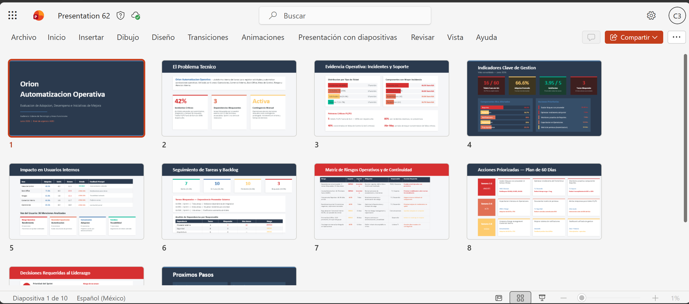
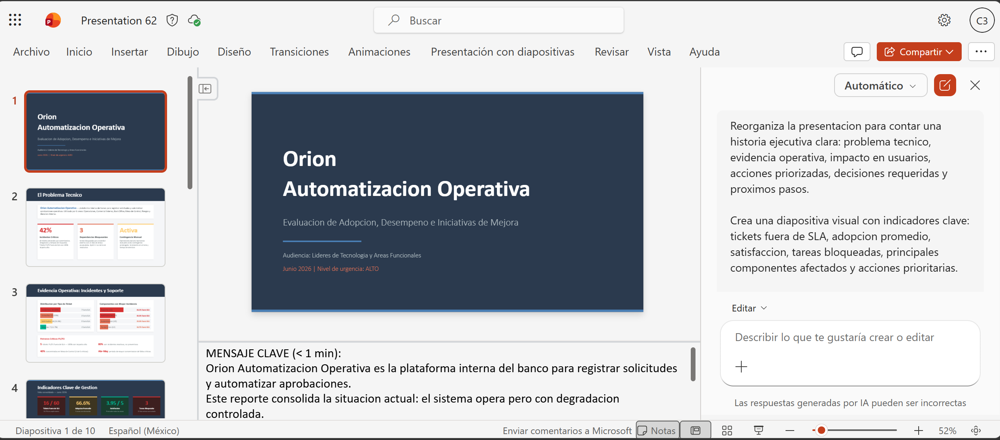
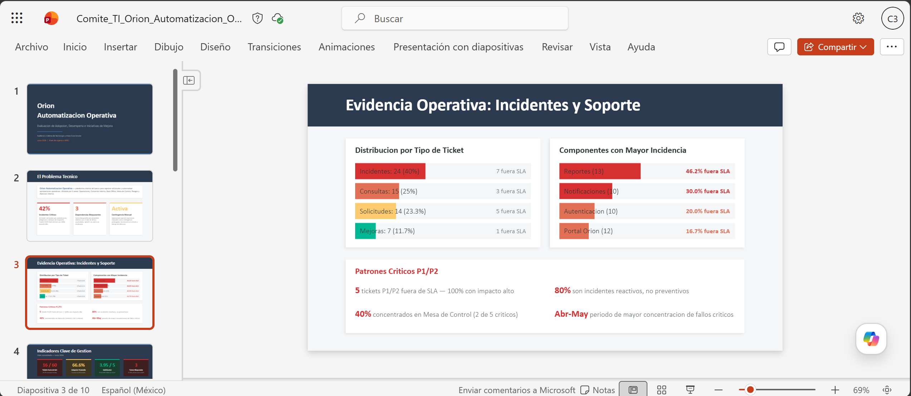

# Demostracion 4. Crear una presentacion ejecutiva de hallazgos tecnicos con Copilot en PowerPoint

## Objetivo de la practica:
Al finalizar la practica, seras capaz de:
- Crear una presentacion ejecutiva con Copilot en PowerPoint a partir de hallazgos tecnicos y operativos.
- Refinar diapositivas sobre adopcion, incidentes, backlog, riesgos y oportunidades de automatizacion.
- Comunicar recomendaciones estrategicas para lideres de Tecnologia y areas funcionales.

## Duracion aproximada:
- 20 minutos.

## Tabla de ayuda:
| Elemento | Valor de referencia | Observaciones |
| --- | --- | --- |
| Aplicacion principal | PowerPoint con Copilot | Usar cuenta corporativa con Microsoft 365 Copilot. |

## Instrucciones

### Tarea 1. Crear la presentacion desde el documento de trabajo.

**Paso 1.** Abrir Microsoft PowerPoint en el navegador o en la aplicacion de escritorio.

**Paso 2.** Crear una presentacion en blanco y abrir el panel de Copilot.

**Paso 3.** Seleccionar la opcion para crear presentacion desde archivo o agregar contenido de trabajo. Adjuntar el bloque de contexto consolidado en Outlook, los hallazgos de Excel y el backlog priorizado generado con Microsoft 365 Copilot.

Prompt sugerido:
```text
Crea una presentacion ejecutiva de 10 diapositivas a partir de este documento. La audiencia son lideres de Tecnologia y areas funcionales del banco. El objetivo es evaluar adopcion, desempeno e iniciativas de mejora de Orion Automatizacion Operativa.

Incluye:
1. Portada ejecutiva.
2. Contexto de la solucion.
3. Hallazgos sobre incidentes y soporte.
4. Metricas de adopcion y experiencia de usuarios internos.
5. Seguimiento de tareas y backlog.
6. Riesgos operativos y de continuidad.
7. Oportunidades de automatizacion.
8. Plan de accion de 60 dias.
9. Decisiones requeridas a liderazgo.
10. Proximos pasos.
```

**Paso 4.** Esperar a que Copilot genere el primer borrador.



---

### Tarea 2. Refinar narrativa, claridad y enfoque ejecutivo.

**Paso 1.** Pedir a Copilot que reorganice la narrativa.

Prompt sugerido:
```text
Reorganiza la presentacion para contar una historia ejecutiva clara: problema tecnico, evidencia operativa, impacto en usuarios, acciones priorizadas, decisiones requeridas y proximos pasos.
```

**Paso 2.** Solicitar una diapositiva visual de metricas.

Prompt sugerido:
```text
Crea una diapositiva visual con indicadores clave: tickets fuera de SLA, adopcion promedio, satisfaccion, tareas bloqueadas, principales componentes afectados y acciones prioritarias.
```

**Paso 3.** Solicitar una diapositiva de riesgos y mitigaciones.

Prompt sugerido:
```text
Convierte la seccion de riesgos en una matriz con las columnas: Riesgo, impacto, urgencia, mitigacion, responsable y decision requerida.
```

**Paso 4.** Generar notas del presentador.

Prompt sugerido:
```text
Genera notas del presentador para cada diapositiva. Las notas deben explicar el mensaje clave en menos de un minuto, con tono ejecutivo y orientado a decisiones.
```



---

### Tarea 3. Validar la presentacion final.
**Paso 1.** Confirmar que la presentacion responda estas preguntas:
- Que problema tecnico u operativo se observo?
- Que evidencia sustenta el analisis?
- Que riesgos existen para continuidad y adopcion?
- Que iniciativas deben priorizarse?
- Que decisiones debe tomar liderazgo?

**Paso 2.** Guardar la presentacion como `Comite_TI_Orion_Automatizacion_Operativa`.

### Resultado esperado
Al finalizar, el instructor debe tener una presentacion ejecutiva lista para revision humana con hallazgos tecnicos, metricas de adopcion, riesgos operativos, backlog priorizado y recomendaciones estrategicas.

